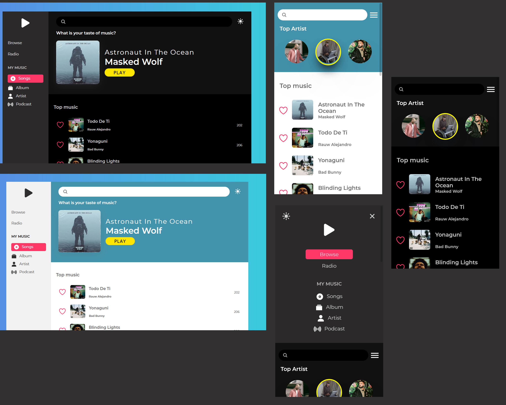

# SoSong v1.0.0 [URL](https://so-song.vercel.app/)

## Description

SoSong is a music streaming platform. Users can search through songs,artist,podcasts and many more. This application is based on [Deezer developers api](https://developers.deezer.com) . Music plays for only 30 second because of the restrictions on Deezer api for developers.

NextJS, React , Sass and vanilla Javascript were some of the technologies used for this project. I used nextJs for SSR(Sever side rendering) React (front end) and sass for styling.

In my future update, I hope to extend the duration of the music and add more features like.

- Add to favorite on the server side
- authentication
- Playlist

## Credits

- [Deeser API](https://developers.deezer.com)
- ionicons

## License

[MIT](https://choosealicense.com/licenses/mit/)
